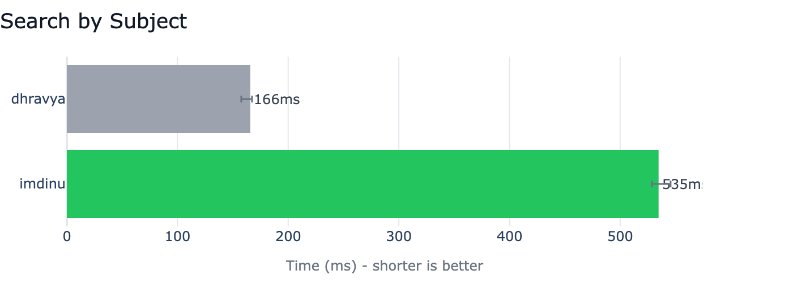

# Benchmarks

Competitive benchmarks comparing [apple-mail-mcp](https://github.com/imdinu/apple-mail-mcp) against other Apple Mail MCP servers — inspired by [uv's BENCHMARKS.md](https://github.com/astral-sh/uv/blob/main/BENCHMARKS.md).

All benchmarks are run at the **MCP protocol level**: we spawn each server as a subprocess, connect as a JSON-RPC client over stdio, and time real tool calls. This measures what an AI assistant actually experiences — not synthetic microbenchmarks.

## Test Environment

| Property | Value |
|----------|-------|
| **macOS** | 26.2 (Tahoe) |
| **Chip** | Apple M4 Max |
| **Python** | 3.14.3 |
| **Date** | 2026-02-16 |

## Competitors

| # | Project | Type | Notes |
|---|---------|------|-------|
| 1 | **[imdinu/apple-mail-mcp](https://github.com/imdinu/apple-mail-mcp)** (ours) | Dedicated | Batch JXA + FTS5 index |
| 2 | **[patrickfreyer/apple-mail-mcp](https://github.com/patrickfreyer/apple-mail-mcp)** | Dedicated | Python + AppleScript |
| 3 | **[kiki830621/che-apple-mail-mcp](https://github.com/kiki830621/che-apple-mail-mcp)** | Dedicated | Swift |
| 4 | **[fatbobman/mail-mcp-bridge](https://github.com/fatbobman/mail-mcp-bridge)** | Dedicated | Python bridge |
| 5 | **[dhravya/apple-mcp](https://github.com/supermemoryai/apple-mcp)** | Multi-app | TypeScript (archived) |
| 6 | **[steipete/macos-automator-mcp](https://github.com/steipete/macos-automator-mcp)** | Generic | Runs arbitrary AppleScript |
| 7 | **[PeakMojo/applescript-mcp](https://github.com/PeakMojo/applescript-mcp)** | Generic | Runs arbitrary AppleScript |
| 8 | **[54yyyu/pyapple-mcp](https://github.com/54yyyu/pyapple-mcp)** | Multi-app | Python |

## Scenarios

| Scenario | What It Measures | Why It Matters |
|----------|-----------------|----------------|
| **Cold Start** | Process spawn → MCP `initialize` response | First-use experience, CI startup time |
| **List Accounts** | Time to list all mail accounts | Simplest operation, baseline latency |
| **Fetch Emails** | Get 50 emails from inbox | Core use case for AI assistants |
| **Search: Subject** | Search by subject keyword | Available in most servers |
| **Search: Body** | Full-text body search | Our FTS5 differentiator |

Each scenario: **3 warmup runs + 5 measured runs**. We report the **median** with **p5/p95** error bars for variance.

## Results

### Cold Start

Time from spawning the server process to receiving an MCP `initialize` response. All 7 working competitors participated. Lightweight Python servers (fatbobman, pyapple, patrickfreyer) start fastest. Node.js servers (dhravya, peakmojo) have higher cold start due to the Node runtime.


### List Accounts

The simplest mail operation. We're the **fastest dedicated mail server** at 108ms. Generic executors (steipete, peakmojo) pay ~1s overhead for AppleScript round-trips through their execution layer.


### Fetch 50 Emails

This is where architecture matters. Our batch JXA approach (529ms) is **29x faster** than patrickfreyer's per-message AppleScript iteration (15,288ms). Generic executors time out entirely at 60s — raw AppleScript cannot iterate 50 messages within their timeout window.


### Search by Subject

Search emails by subject line containing "meeting". Most competitors either timed out or lack subject search. patrickfreyer's AppleScript search timed out at 60s.



### Search by Body

Full-text search through email body content. **We are the only server that supports body search** via our FTS5 index (549ms). Every other competitor either lacks the feature entirely or times out attempting to iterate through email bodies via AppleScript.


## Caveats

1. **Mailbox size matters.** Benchmark performance depends on the number of emails in your inbox. These results use the mailbox described in the test environment above.

2. **FTS5 requires one-time indexing.** Body search via our FTS5 index requires a one-time `apple-mail-mcp index` build. Cold start time does NOT include indexing. The index persists across runs.

3. **Generic executors are not mail-specific.** PeakMojo and steipete are general-purpose AppleScript/automation servers. We benchmark them with equivalent mail AppleScript for fair comparison, but they have different overhead profiles.

4. **macOS and Mail.app versions matter.** AppleScript and JXA performance can vary across macOS versions and Mail.app configurations.

5. **Archived projects are benchmarked as-is.** dhravya/apple-mcp is archived with known bugs. Benchmark failures are valid data points.

6. **All operations are local.** No network involved — all servers communicate with the local Mail.app via Apple Events or filesystem access.

## Methodology

- **Protocol**: MCP over JSON-RPC/stdio (spawn subprocess, connect, time tool calls)
- **Warmup**: 3 runs discarded before measurement
- **Measured**: 5 runs per scenario
- **Statistic**: Median (robust to outliers)
- **Variance**: p5/p95 shown as error bars
- **Tool calls**: For non-cold-start scenarios, a single server process handles all runs

## Reproduction

```bash
# 1. Install competitors
bash benchmarks/setup.sh

# 2. Run all benchmarks
uv run --group bench python -m benchmarks.run

# 3. Generate charts
uv run --group bench python -m benchmarks.charts

# Run a single competitor
uv run --group bench python -m benchmarks.run --competitor imdinu

# Run a single scenario
uv run --group bench python -m benchmarks.run --scenario cold_start

# Custom run count
uv run --group bench python -m benchmarks.run --warmup 3 --runs 20
```
