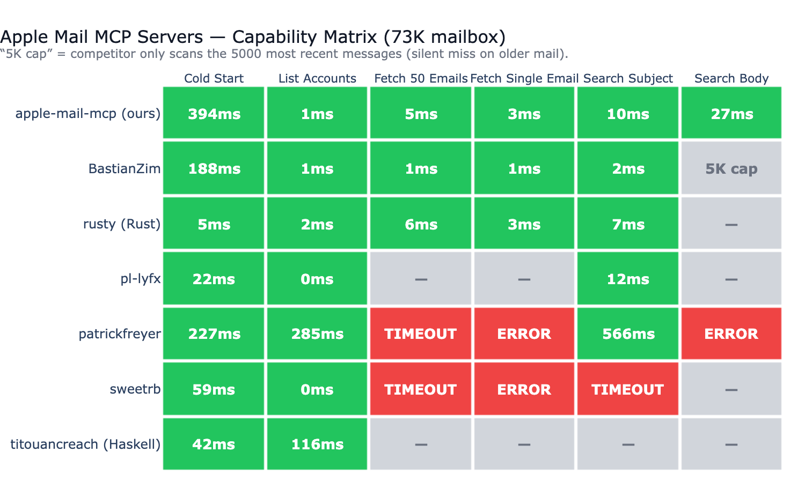

# Apple Mail MCP

<!-- mcp-name: io.github.imdinu/apple-mail-mcp -->

[](https://www.python.org/downloads/)
[](https://www.gnu.org/licenses/gpl-3.0)
[](https://www.apple.com/macos/)
[](https://modelcontextprotocol.io/)
[](https://github.com/astral-sh/ruff)
[](https://github.com/imdinu/apple-mail-mcp/actions/workflows/lint.yml)

The only Apple Mail MCP server with **full-text email search**. Reliable on large mailboxes where other servers timeout — with 8 tools for reading, searching, and extracting email content.

**[Read the docs](https://imdinu.github.io/apple-mail-mcp/)** for the full guide.

## Quick Start

```bash
pipx install apple-mail-mcp
```

Add to your MCP client:

```json
{
  "mcpServers": {
    "mail": {
      "command": "apple-mail-mcp"
    }
  }
}
```

### Build the Search Index (Recommended)

```bash
# Requires Full Disk Access for Terminal
# System Settings → Privacy & Security → Full Disk Access → Add Terminal

apple-mail-mcp index --verbose
```

## Tools

| Tool | Purpose |
|------|---------|
| `list_accounts()` | List email accounts |
| `list_mailboxes(account?)` | List mailboxes |
| `get_emails(filter?, limit?)` | Get emails — all, unread, flagged, today, last_7_days |
| `get_email(message_id)` | Get single email with full content + attachments |
| `search(query, scope?, before?, after?, highlight?)` | Search — all, subject, sender, body, attachments |
| `get_email_links(message_id)` | Extract links from an email |
| `get_email_attachment(message_id, filename)` | Extract attachment content |
| `get_attachment(message_id, filename)` | *Deprecated* — use `get_email_attachment()` |

## Performance

Tested against [8 other Apple Mail MCP servers](https://imdinu.github.io/apple-mail-mcp/benchmarks/) on a real **~72K-message** mailbox:

- **Only server with full-coverage body search.** Most competitors don't support body search at all; the one that does (BastianZim) live-scans only the 5000 most recent messages — silent miss on anything older. Our FTS5 index covers the entire mailbox.
- **~3ms single email fetch** via disk-first `.emlx` reading (no JXA round-trip).
- **~7ms subject search** via FTS5 — competitive with native Rust on the same operation.
- **Reliable across all 6 benchmarked operations** on a 72K mailbox; AppleScript-based servers timeout, throw syntax errors, or skip operations they don't support.



## Configuration

| Variable | Default | Description |
|----------|---------|-------------|
| `APPLE_MAIL_DEFAULT_ACCOUNT` | First account | Default email account |
| `APPLE_MAIL_DEFAULT_MAILBOX` | `INBOX` | Default mailbox |
| `APPLE_MAIL_INDEX_PATH` | `~/.apple-mail-mcp/index.db` | Index location |
| `APPLE_MAIL_INDEX_MAX_EMAILS` | _unset_ | Optional per-mailbox ceiling (default: uncapped) |
| `APPLE_MAIL_INDEX_EXCLUDE_ACCOUNTS` | _unset_ | Account names or UUIDs to skip during indexing |
| `APPLE_MAIL_INDEX_INCLUDE_MAILBOXES` | _unset_ | Optional mailbox allow-list for indexing |
| `APPLE_MAIL_INDEX_EXCLUDE_MAILBOXES` | `Drafts` | Mailboxes to skip during indexing |
| `APPLE_MAIL_READ_ONLY` | `false` | Disable write operations |

```json
{
  "mcpServers": {
    "mail": {
      "command": "apple-mail-mcp",
      "args": ["--watch"],
      "env": {
        "APPLE_MAIL_DEFAULT_ACCOUNT": "iCloud",
        "APPLE_MAIL_INDEX_EXCLUDE_ACCOUNTS": "Work"
      }
    }
  }
}
```

`APPLE_MAIL_DEFAULT_ACCOUNT` only chooses the default live Mail account for
tools. To keep an account out of full-text search, use
`APPLE_MAIL_INDEX_EXCLUDE_ACCOUNTS` and rebuild the index.

## CLI Usage

All tools are also available as standalone CLI commands (no MCP server needed):

```bash
apple-mail-mcp search "quarterly report" --scope subject
apple-mail-mcp search "invoice" --after 2026-01-01 --limit 10
apple-mail-mcp read 12345
apple-mail-mcp emails --filter unread --limit 10
apple-mail-mcp accounts
apple-mail-mcp mailboxes --account Work
apple-mail-mcp extract 12345 invoice.pdf
```

All commands output JSON. Generate a [Claude Code skill](https://imdinu.github.io/apple-mail-mcp/configuration/#cli-commands) for CLI-based access:

```bash
apple-mail-mcp integrate claude > ~/.claude/skills/apple-mail.md
```

## Development

```bash
git clone https://github.com/imdinu/apple-mail-mcp
cd apple-mail-mcp
uv sync
uv run ruff check src/
uv run pytest
```

## License

GPL-3.0-or-later
