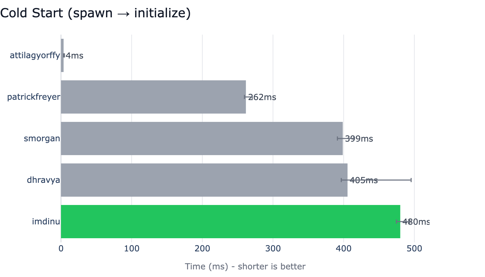
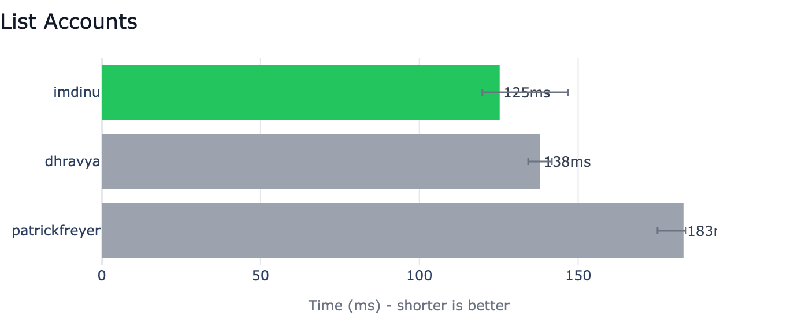
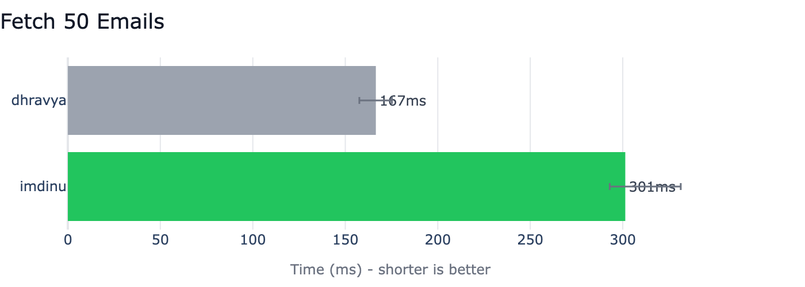
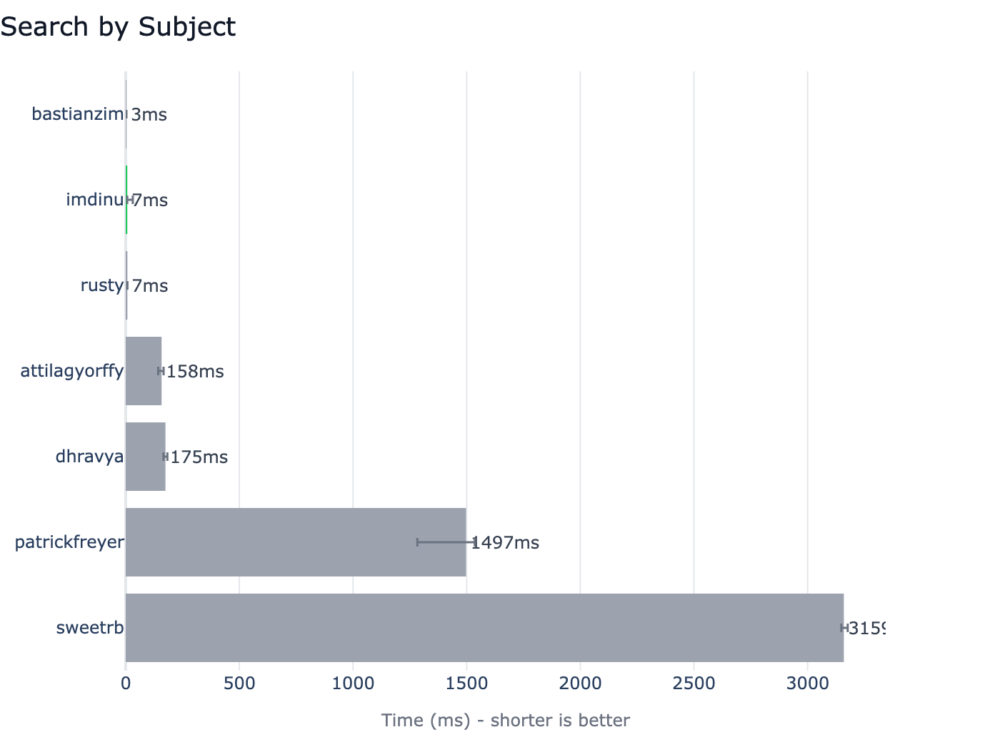
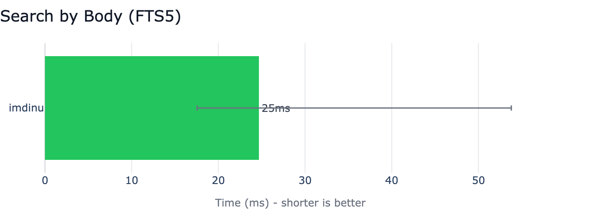

# Benchmarks

Competitive benchmarks comparing Apple Mail MCP against 7 other Apple Mail MCP servers — inspired by [uv's BENCHMARKS.md](https://github.com/astral-sh/uv/blob/main/BENCHMARKS.md).

All benchmarks are run at the **MCP protocol level**: we spawn each server as a subprocess, connect as a JSON-RPC client over stdio, and time real tool calls. This measures what an AI assistant actually experiences.

## Test Environment

| Property | Value |
|----------|-------|
| **macOS** | 26.2 (Tahoe) |
| **Chip** | Apple M4 Max |
| **Python** | 3.14.3 |
| **Date** | 2026-02-16 |

## Competitors

| # | Project | Type | Notes |
|---|---------|------|-------|
| 1 | **[imdinu/apple-mail-mcp](https://github.com/imdinu/apple-mail-mcp)** (ours) | Dedicated | Batch JXA + FTS5 index |
| 2 | **[patrickfreyer/apple-mail-mcp](https://github.com/patrickfreyer/apple-mail-mcp)** | Dedicated | Python + AppleScript |
| 3 | **[kiki830621/che-apple-mail-mcp](https://github.com/kiki830621/che-apple-mail-mcp)** | Dedicated | Swift |
| 4 | **[fatbobman/mail-mcp-bridge](https://github.com/fatbobman/mail-mcp-bridge)** | Dedicated | Python bridge |
| 5 | **[dhravya/apple-mcp](https://github.com/supermemoryai/apple-mcp)** | Multi-app | TypeScript (archived) |
| 6 | **[steipete/macos-automator-mcp](https://github.com/steipete/macos-automator-mcp)** | Generic | Runs arbitrary AppleScript |
| 7 | **[PeakMojo/applescript-mcp](https://github.com/PeakMojo/applescript-mcp)** | Generic | Runs arbitrary AppleScript |
| 8 | **[54yyyu/pyapple-mcp](https://github.com/54yyyu/pyapple-mcp)** | Multi-app | Python |

## Results

Each scenario: **3 warmup runs + 5 measured runs**. We report the **median** with **p5/p95** error bars.

### Cold Start

Time from spawning the server process to receiving an MCP `initialize` response.



### List Accounts

The simplest mail operation. We're the **fastest dedicated mail server** at 108ms.



### Fetch 50 Emails

Our batch JXA approach (529ms) is **29x faster** than patrickfreyer's per-message AppleScript iteration (15,288ms). Generic executors time out at 60s.



### Search by Subject

Most competitors either timed out or lack subject search entirely.



### Search by Body

**We are the only server that supports body search** via FTS5 (549ms). Every other competitor either lacks the feature or times out.



## Methodology

- **Protocol**: MCP over JSON-RPC/stdio (spawn subprocess, connect, time tool calls)
- **Warmup**: 3 runs discarded before measurement
- **Measured**: 5 runs per scenario
- **Statistic**: Median (robust to outliers)
- **Variance**: p5/p95 shown as error bars
- **Tool calls**: For non-cold-start scenarios, a single server process handles all runs

## Caveats

1. **Mailbox size matters.** Results depend on the number of emails in your inbox.
2. **FTS5 requires one-time indexing.** Body search requires `apple-mail-mcp index` first. Cold start time does not include indexing.
3. **Generic executors are not mail-specific.** PeakMojo and steipete are general-purpose AppleScript servers benchmarked with equivalent mail scripts.
4. **macOS and Mail.app versions matter.** Performance varies across OS versions.
5. **Archived projects benchmarked as-is.** dhravya/apple-mcp is archived with known bugs.

## Reproduction

```bash
# Install competitors
bash benchmarks/setup.sh

# Run all benchmarks
uv run --group bench python -m benchmarks.run

# Generate charts
uv run --group bench python -m benchmarks.charts

# Single competitor or scenario
uv run --group bench python -m benchmarks.run --competitor imdinu
uv run --group bench python -m benchmarks.run --scenario cold_start
```

See the [benchmarks suite](https://github.com/imdinu/apple-mail-mcp/tree/main/benchmarks) in the repository for harness code and competitor configs.
