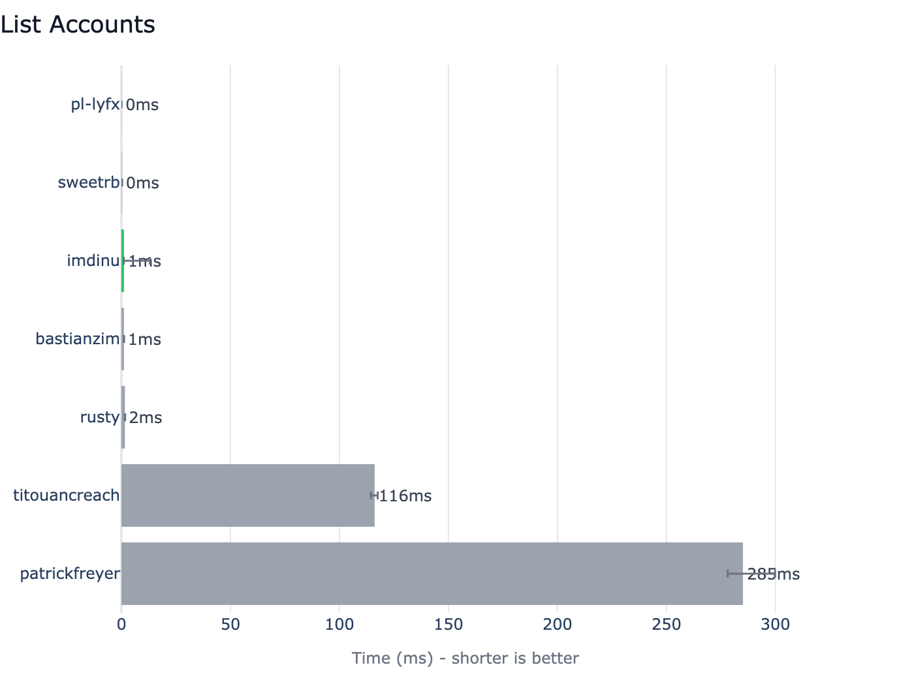
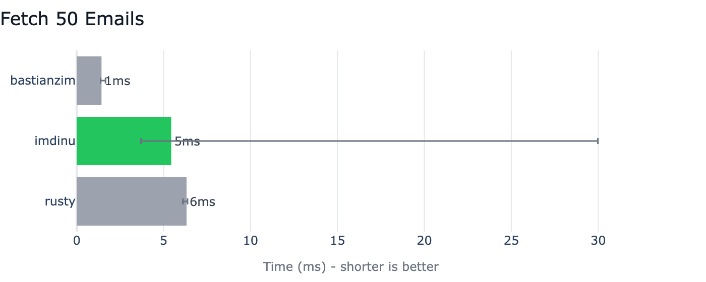
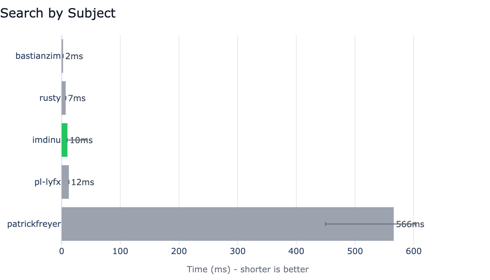

# Benchmarks

Competitive benchmarks comparing Apple Mail MCP against 5 other Apple Mail MCP servers — inspired by [uv's BENCHMARKS.md](https://github.com/astral-sh/uv/blob/main/BENCHMARKS.md).

All benchmarks are run at the **MCP protocol level**: we spawn each server as a subprocess, connect as a JSON-RPC client over stdio, and time real tool calls. This measures what an AI assistant actually experiences.

## Test Environment

| Property | Value |
|----------|-------|
| **macOS** | 26.3.1 (Tahoe) |
| **Chip** | Apple M4 Max |
| **Python** | 3.12.0 |
| **Date** | 2026-03-10 |

## Competitors

| # | Project | Type | Notes |
|---|---------|------|-------|
| 1 | **[imdinu/apple-mail-mcp](https://github.com/imdinu/apple-mail-mcp)** (ours) | Dedicated | Disk-first + batch JXA + FTS5 |
| 2 | **[patrickfreyer/apple-mail-mcp](https://github.com/patrickfreyer/apple-mail-mcp)** | Dedicated | Python + AppleScript, 26 tools |
| 3 | **[dhravya/apple-mcp](https://github.com/supermemoryai/apple-mcp)** | Multi-app | TypeScript (archived Jan 2026) |
| 4 | **[s-morgan-jeffries/apple-mail-mcp](https://github.com/s-morgan-jeffries/apple-mail-mcp)** | Dedicated | Python + FastMCP |
| 5 | **[attilagyorffy/apple-mail-mcp](https://github.com/attilagyorffy/apple-mail-mcp)** | Dedicated | Go binary |

## Results

Each scenario: **5 warmup runs + 10 measured runs**. We report the **median** with **p5/p95** error bars. A single probe call screens out tools that exceed 10 seconds, and responses are validated for correctness (tools that return errors are marked as failed).

### Cold Start

Time from spawning the server process to receiving an MCP `initialize` response.

| Server | Median | p5 | p95 |
|--------|-------:|---:|----:|
| attilagyorffy (Go) | **10ms** | 3.7 | 13.3 |
| patrickfreyer | 273ms | 263 | 285 |
| s-morgan-jeffries | 368ms | 356 | 392 |
| dhravya | 386ms | 377 | 440 |
| **apple-mail-mcp** | 443ms | 423 | 467 |


### List Accounts

The simplest mail operation. We're the **fastest** at 118ms.

| Server | Median | p5 | p95 |
|--------|-------:|---:|----:|
| **apple-mail-mcp** | **118ms** | 114 | 153 |
| dhravya | 134ms | 119 | 144 |
| patrickfreyer | 184ms | 183 | 199 |
| s-morgan-jeffries | — | — | — |
| attilagyorffy | — | — | — |



### Fetch 50 Emails

We are the **only server that successfully returns email data** in a competitive time. s-morgan-jeffries and attilagyorffy both crash with AppleScript errors. patrickfreyer works but takes 14s (screened out by the 10s probe cutoff). dhravya returns "No unread emails" — a different operation.

| Server | Median | p5 | p95 | Status |
|--------|-------:|---:|----:|--------|
| **apple-mail-mcp** | **301ms** | 293 | 331 | 50 emails returned |
| dhravya | 167ms | 158 | 175 | "No unread emails" (different operation) |
| patrickfreyer | ~13,800ms | — | — | too slow (screened out) |
| s-morgan-jeffries | — | — | — | error: `whose true` crash |
| attilagyorffy | — | — | — | error: date parsing bug |



### Fetch Single Email

Our disk-first strategy reads `.emlx` files directly — no JXA needed. **We're the only server with a dedicated single-email fetch tool** that returns full content at disk speed.

| Server | Median | p5 | p95 | Status |
|--------|-------:|---:|----:|--------|
| **apple-mail-mcp** | **5.9ms** | 2.9 | 47.2 | Full content via .emlx disk read |
| patrickfreyer | — | — | — | ID discovery failed |
| Others | — | — | — | Not supported |


### Search by Subject

Our FTS5 column filter makes us **15x faster** than the next competitor.

| Server | Median | p5 | p95 |
|--------|-------:|---:|----:|
| **apple-mail-mcp** | **10ms** | 6.7 | 46.3 |
| attilagyorffy (Go) | 148ms | 141 | 152 |
| dhravya | 166ms | 158 | 174 |
| s-morgan-jeffries | — | — | — |
| patrickfreyer | timeout | — | — |



### Search by Body

**We are the only server that supports body search** via FTS5 at 22ms. No other competitor implements this feature.


## Methodology

- **Protocol**: MCP over JSON-RPC/stdio (spawn subprocess, connect, time tool calls)
- **Warmup**: 5 runs discarded before measurement
- **Measured**: 10 runs per scenario
- **Statistic**: Median (robust to outliers)
- **Variance**: p5/p95 shown as error bars
- **Tool calls**: For non-cold-start scenarios, a single server process handles all runs
- **Probe screening**: A single probe call runs before warmup; if it exceeds 10s the scenario is skipped
- **Response validation**: Tool responses are checked for hidden errors (e.g. `{"success": false}` inside valid MCP content)

## Caveats

1. **Mailbox size matters.** Results depend on the number of emails in your inbox.
2. **FTS5 requires one-time indexing.** Body and subject search require `apple-mail-mcp index` first. Cold start time does not include indexing.
3. **Not all servers support all operations.** s-morgan-jeffries and attilagyorffy lack `list_accounts` and body search. patrickfreyer's search timed out. s-morgan-jeffries and attilagyorffy crash on `get_emails`.
4. **macOS and Mail.app versions matter.** Performance varies across OS versions.
5. **Archived projects benchmarked as-is.** dhravya/apple-mcp is archived with known bugs.
6. **Response validation may differ.** Some servers return errors inside valid MCP responses without setting the `isError` flag. Our harness detects `{"success": false}` payloads and marks these as failures.

## Reproduction

```bash
# Install competitors
bash benchmarks/setup.sh

# Run all benchmarks
uv run --group bench python -m benchmarks.run

# Generate charts
uv run --group bench python -m benchmarks.charts

# Single competitor or scenario
uv run --group bench python -m benchmarks.run --competitor imdinu
uv run --group bench python -m benchmarks.run --scenario cold_start

# Custom probe cutoff (default: 10s)
uv run --group bench python -m benchmarks.run --cutoff 5000
```

See the [benchmarks suite](https://github.com/imdinu/apple-mail-mcp/tree/main/benchmarks) in the repository for harness code and competitor configs.
